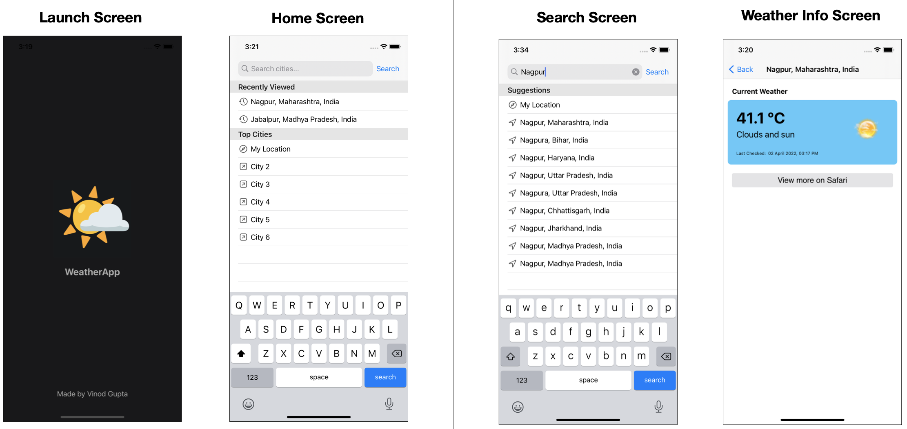

# WeatherApp

An iOS app that shows the weather info of any city. The data is collected from [AccuWeather APIs](https://developer.accuweather.com/apis)

### End user features
- Current location detection - users can select current location and the weather info is fetched using current [Geo Position](https://en.wikipedia.org/wiki/Geopositioning)
- Search any city
- View recent searches

### Technical features
- MVVM ([Model-View-ViewModel](https://en.wikipedia.org/wiki/Model%E2%80%93view%E2%80%93viewmodel)) architecture pattern
- Generic Service Manager for interacting with APIs - An extension of URLSession, which acts as middleware for making any HTTP request
- Standard iOS coding best practices
- Store recent searches in local store (UserDefaults)

### Tools used
- XCode 12.5.1
- Swift 5.5
- UIKit

### Snapshots

